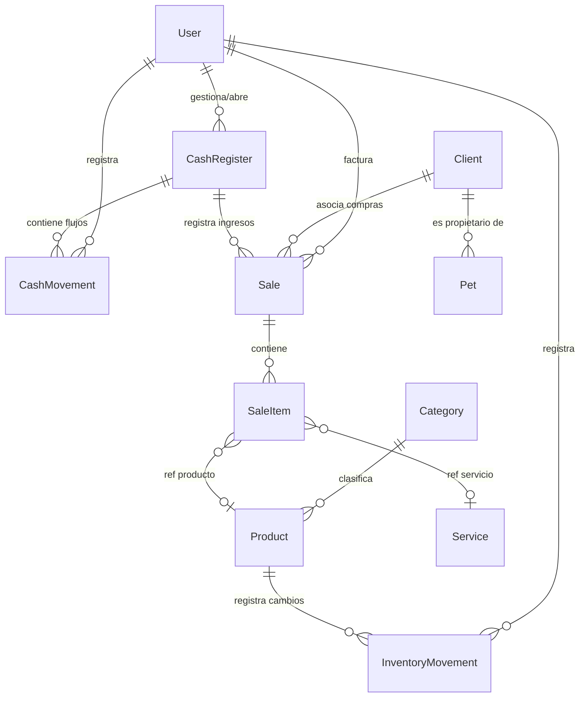
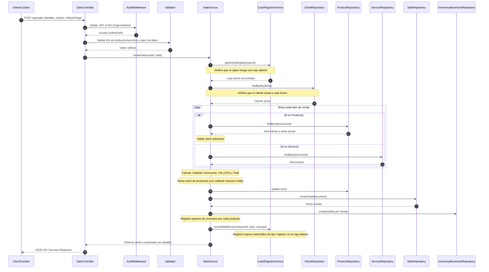

# Sistema de Gestión Veterinaria - API Backend

Este proyecto consiste en el backend completo de un sistema profesional para la gestión de una veterinaria. Está desarrollado en **Node.js**, **TypeScript**, **Express** y **MongoDB (Mongoose)**, bajo buenas prácticas de diseño de software (principios SOLID, Clean Code, inyección de dependencia estructurada y separación estricta en capas).

---

## 🛠️ Stack Tecnológico
*   **Lenguaje**: TypeScript
*   **Runtime**: Node.js
*   **Framework Web**: Express.js
*   **Base de Datos**: MongoDB
*   **ODM**: Mongoose
*   **Autenticación**: JWT (JsonWebToken)
*   **Seguridad**: bcrypt (Hashing de contraseñas), Middleware de autorización (RBAC)
*   **Validaciones**: express-validator

---

## 📐 Arquitectura del Proyecto

El backend se organiza en una arquitectura basada en capas desacopladas:

1.  **Rutas (`src/routes/`)**: Capturan la petición HTTP, aplican la validación de formato y la autenticación, y delegan la ejecución al controlador.
2.  **Validaciones (`src/validators/`)**: Middleware con reglas estrictas usando `express-validator`.
3.  **Middlewares (`src/middlewares/`)**: Autenticación JWT, verificación de roles (RBAC), control y parseo de errores global.
4.  **Controladores (`src/controllers/`)**: Extraen datos de la petición (cuerpo, parámetros, query), ejecutan el servicio de negocio correspondiente y formatean la respuesta estándar JSON. **No contienen lógica de negocio**.
5.  **Servicios (`src/services/`)**: Contienen el núcleo de la lógica de negocio (validación de stock, cálculos de totales, flujo de caja diario, auditoría de inventario y rollbacks manuales).
6.  **Repositorios (`src/repositories/`)**: Encapsulan el acceso directo a la base de datos (Mongoose). Los servicios interactúan únicamente con repositorios.
7.  **Modelos (`src/models/`)**: Definen esquemas, índices y validadores a nivel de base de datos para MongoDB.

---

## 📊 Relaciones de Colecciones

A continuación se detalla la estructura y referencias entre las colecciones de la base de datos:



---

## 🔄 Flujos del Sistema

### 1. Flujo Completo de una Venta



### 2. Flujo Completo de Apertura y Cierre de Caja

*   **Apertura**:
    1. El usuario envía el `montoInicial`.
    2. El servicio valida que el usuario **no tenga una caja activa** (`estado: "Abierta"`).
    3. Se crea el documento de caja marcándolo como `"Abierta"`, estableciendo el `efectivoEsperado = montoInicial`.
*   **Cierre**:
    1. El usuario envía el `efectivoContado` físico existente.
    2. El servicio extrae todos los movimientos asociados a la caja (`ventas`, `ingresos manuales` y `egresos manuales`).
    3. Se recalcula el `efectivoEsperado = montoInicial + ventas + ingresos - egresos`.
    4. Se calcula la diferencia: `diferencia = efectivoContado - efectivoEsperado`.
    5. Se actualiza la caja guardando los totales reales calculados y cambiando el estado a `"Cerrada"`.

---

## 🚀 Guía de Instalación y Ejecución

### Requisitos Previos
*   **Node.js** (v18 o superior recomendado)
*   **MongoDB** (Local o en la nube como Atlas)

### Pasos de Configuración

1.  **Instalar dependencias**:
    ```bash
    npm install
    ```

2.  **Configurar Variables de Entorno**:
    Copia el archivo `.env.example` y renómbralo a `.env`:
    ```bash
    cp .env.example .env
    ```
    Edita las credenciales, puerto y cadena de conexión a MongoDB.

3.  **Ejecutar el Seed (Poblar Base de Datos)**:
    Este script limpia las colecciones existentes e inserta datos completos de prueba (usuarios con claves encriptadas, clientes, mascotas, categorías, productos, servicios, cajas cerradas y abiertas con ventas cargadas):
    ```bash
    npm run seed
    ```

4.  **Crear Usuario Administrador Inicial (Opcional)**:
    Si solo deseas crear el administrador configurado en tu `.env` sin borrar los demás datos:
    ```bash
    npm run create-admin
    ```

5.  **Iniciar Servidor en Modo de Desarrollo**:
    ```bash
    npm run dev
    ```
    El servidor iniciará en: `http://localhost:5000` (o el puerto configurado).

6.  **Compilar y Ejecutar en Producción**:
    ```bash
    npm run build
    npm start
    ```

---

## 📬 Colección de Postman

Toda la API está documentada e integrada en los archivos de la carpeta `postman/`:

1.  **Colección (`postman/collection.json`)**: Contiene carpetas para todos los módulos de negocio con ejemplos y scripts para encadenar peticiones (capturar el token JWT e IDs y usarlos en las siguientes consultas).
2.  **Entorno (`postman/environment.json`)**: Configura el host de destino y variables dinámicas.

**Cómo Importar en Postman**:
1. Abre Postman y haz clic en **Import**.
2. Arrastra y suelta los dos archivos JSON ubicados en la carpeta `postman/` de este proyecto.
3. Selecciona el entorno `"Veterinary System Environment"` en la esquina superior derecha.
4. Ejecuta el endpoint `Login` dentro de la carpeta `Autenticación` con el usuario `admin` y clave `Admin123!`. ¡El token se guardará solo y podrás ejecutar el resto de endpoints de inmediato!
